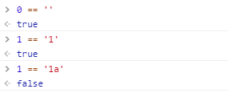

### 在做比较的过程中,`==`会有很多坑,一不小心就会触发莫名其妙的bug.这是因为不同数据类型做`==`比较时有可能会进行类型转换,下面是一些转换规则.

1. 当与null或undefined比较时
    ```javascript
    null == undefined // true
    // 其余比较都返回false
    ```
    

2. 当Number类型(x)与String类型(y)比较时,返回`x === Number(y)`的结果
    <br>String类型转换成Number
    ```javascript
    Number('') // 0
    Number('1') // 1
    Number('11a') // NaN
    Number('aaa') // NaN
    ```
    

3. 当Boolean类型(x)与其他类型(y)比较时,返回`Number(x) == y`的结果
    <br>Boolean类型转换成Number
    ```javascript
    Number(true) // 1
    Number(false) // 0
    ```
    

4. 当Object类型(x)与Number、String类型(y)比较时,返回`ToPrimitive(x) == y`的结果
    <br>ToPrimitive转换规则如下(如果是Date实例的话则步骤1和2顺序对调):
    1. 调用valueOf方法,如果是原始数据类型则返回,否则下一步
    2. 调用toString方法,如果是原始数据类型则返回,否则下一步
    3. 抛出异常
    ```javascript
    var obj = {}
    var arr = [1,2,3]
    obj.valueOf() // {} 非原始数据类型
    obj.toString() // "[object Object]" 原始数据类型 返回
    obj == "[object Object]" // true
    arr.valueOf() // [1,2,3] 非原始数据类型
    arr.toString() // "1,2,3" 实际上调用的是Array.prototype.join方法 原始数据类型 返回
    arr == '1,2,3' // true
    arr = [100]
    arr == '100' // true
    arr == 100 // true
    ```

5. 找不到以上规则时,返回false

