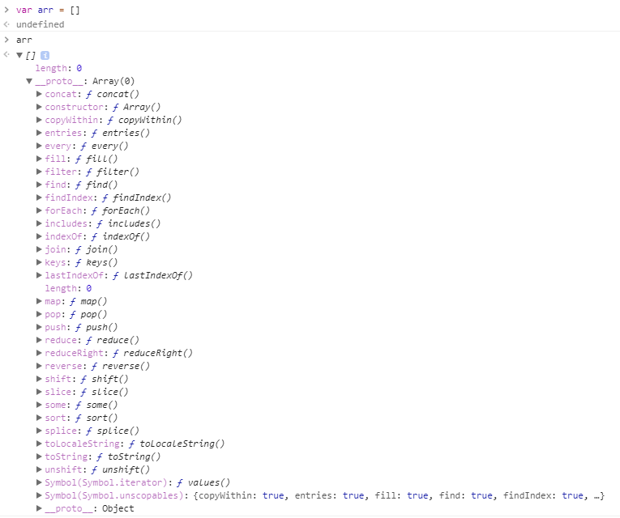
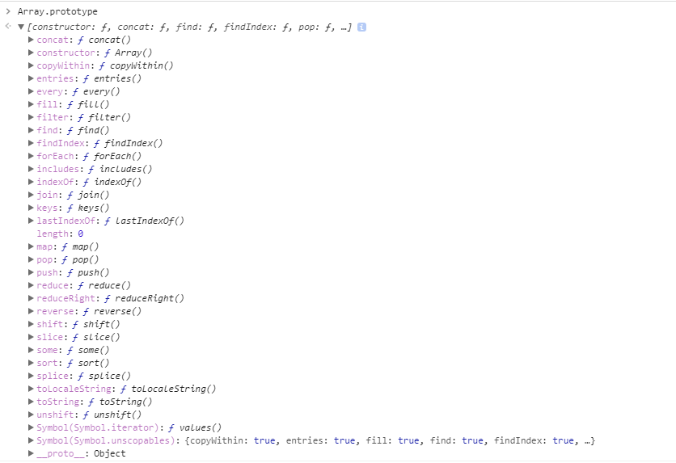
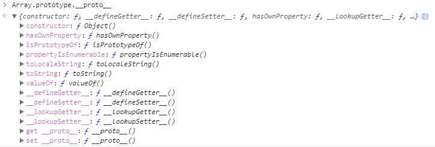
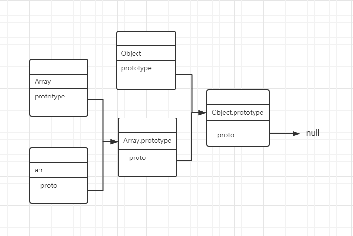
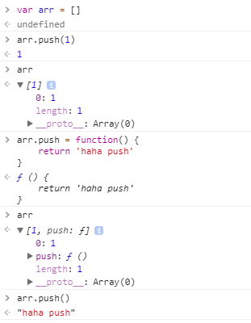
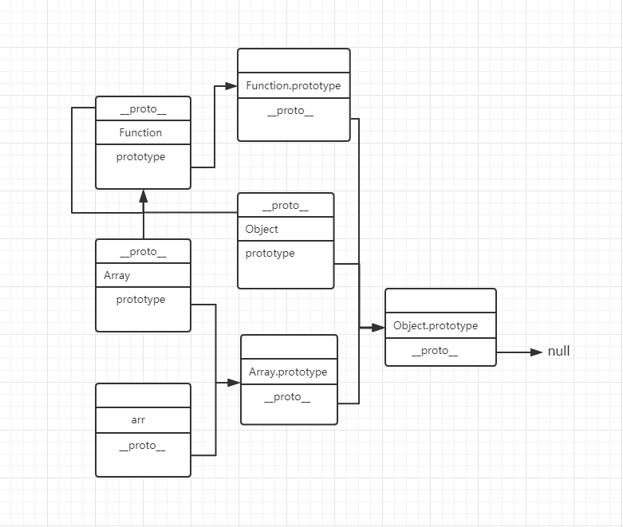

## 原型和原型链

首先来看声明一个空数组`var arr = []`
<br>
可以看到这个arr变量上有一个length属性和一个__proto__(double underscore proto)属性<br>
我们知道Array的原型`Array.prototype`上有很多数组的方法
<br>
而`arr.push(1)`可以调用`Array.prototype`上的这些方法<br>
实际上`arr.__proto__ === Array.prototype // true`,`arr.push(1)`实际上调用的是`arr.__proto__.push`方法<br>
在js中,万物皆对象,每一个对象上都会有__proto__这个属性,那`Array.prototype.__proto__ === ?`是什么东西呢?
<br>
实际上`Array.prototype.__proto__ === Object.prototype // true`指向的是Object的原型<br>
而`Object.prototype.__proto__ === null // true`,Object.prototype就是万物的终点,再往前一步就是虚无了<br>
我们再回过头来看<br>
```javascript
arr.__proto__ === Array.prototype // true
Array.prototype.__proto__ === Object.prototype // true
arr.__proto__.__proto__ === Object.prototype // true
arr.__proto__.__proto__.__proto__ === null // true
```
一个对象沿着它的__proto__出发,到达一个又一个的__proto__,直到这个属性为null,这就是原型链.
<br>
当我们对一个对象使用`.`操作符调用一个属性时,先会在此对象上寻找此属性,如果找到则返回,如果找不到就会沿着原型链上去找,如果在原型链上都找不到的话则返回undefined<br>
下面测试一下,在arr对象上添加一个push方法<br>
<br>
可以看到执行`arr.push()`时调用的是自身属性上的方法,并不是原型上的方法.<br>
根据原型链的调用规则,我们知道,所有的对象都是可以调用Object.prototype上的方法的,比如<br>
```javascript
arr.hasOwnProperty('length') // true
// 读取一个自身没有且原型链上也没有的属性就会返回undefined
arr.test // undefined
```
根据arr的原型链,我们知道<br>
```javascript
arr instanceof Array // true
arr instanceof Object // true
Array.prototype instanceof Object // true
```
[instanceof运算符说明](https://developer.mozilla.org/zh-CN/docs/Web/JavaScript/Reference/Operators/instanceof)
> instanceof 运算符用来测试一个对象在其原型链中是否存在一个构造函数的 prototype 属性。【摘自MDN】

但是,看到一下这些,可能你就要纳闷,为什么是这样的结果
```javascript
Array instanceof Object // true
String instanceof Object // true
Number instanceof Object // true
Function instanceof Object // true
Function instanceof Function // true 这竟然是？
Object instanceof Function // true 这也是？？
Object instanceof Object // true 这踏马还是？？？
```
这一切是因为这个神奇的东西`Function`<br>
我的理解是Function创造全局构造函数的机器，包括Object和它自身Function
```javascript
// 所以Function有一个神奇的等式
Function.__proto__ === Function.prototype => Function instanceof Function // true
Array.__proto__ === Function.prototype // true
String.__proto__ === Function.prototype // true
Number.__proto__ === Function.prototype // true
Object.__proto__ === Function.prototype => Object instanceof Function // true
```
// 而除Object之外的其他全局构造函数的原型的__proto__都是指向万物的终点Object.prototype，即<br>
```javascript
Function.prototype.__proto__ === Object.prototype // true
// 所以
Function.__proto__.__proto__ === Object.prototype => Function instanceof Object // true
Array.__proto__.__proto__ === Object.prototype // true
String.__proto__.__proto__ === Object.prototype // true
Number.__proto__.__proto__ === Object.prototype // true
Object.__proto__.__proto__ === Object.prototype => Object instanceof Object // true
```
最后一张图总结<br>
<br>
The end!
