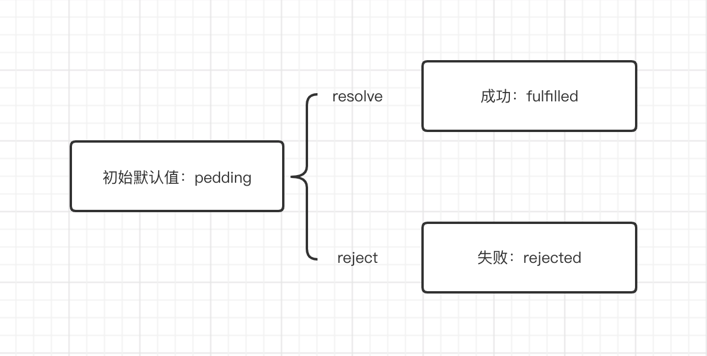

### 从0开始编写一个A+规范的Promise

[promise A+规范](https://juejin.im/post/6844903767654023182)

#### 1. 构造函数

Promise是一个构造函数，入参接收一个函数handle, handle函数又接收(resolve, reject)两个参数，Promise中有三个状态，pedding、rejected、fulfilled。

  
#### 2. 定义状态和值
```javascript
const constant = {
  PEDDING: 'pedding',
  FULFILLED: 'fulfilled',
  REJECTED: 'rejected',
}

class MyPromise {
  constructor(hanlde) {
    this.status = constant.PEDDING
    this.value = undefined
    // 立即执行handle函数
    hanlde(this.handleResolve.bind(this), this.handleReject.bind(this))
  }
  handleResolve(value) {
    this.status = constant.FULFILLED
    this.value = value
  }
  handleReject(value) {
    this.status = constant.REJECTED
    this.value = value
  }
}

const promise = new Promise(handle)
``` 

#### 3. [原型方法then](./3.js)

##### 参数
`then` 方法接受两个参数：
```javascript
promise.then(onFulfilled, onRejected)
```
onFulfilled
- 当 promise 状态变为成功时必须被调用，其第一个参数为 promise 成功状态传入的值（ resolve 执行时传入的值

onRejected
- 当 promise 状态变为失败时必须被调用，其第一个参数为 promise 失败状态传入的值（ reject 执行时传入的值）

##### 多次调用
- `then` 方法可以被同一个 `promise` 对象调用多次
```javascript
promise.then(() => console.log(1))
promise.then(() => console.log(2))
promise.then(() => console.log(3))
```

##### 链式调用
- `then` 方法返回的是一个新的 `Promise` 实例，且支持 `值的传递` 和 `错误捕获`
```javascript
const promise2 = promise.then(onFulfilled, onRejected)
promise2 instanceof MyPromise // true
```
- promise2的回调函数一定得等待promise的状态发生改变才执行调用
- 如果 `onFulfilled` 或者 `onRejected` 是一个函数且返回一个值 `x`
  - x为Promise实例，promise2的回调函数就会等待x的状态发生变化才会调用，并且传递x
  的状态和值
  - x非Promise实例，传递promise的状态和值

- 如果 `onRejected` 为函数且状态为 `rejected`，向promise2传递 `fulfilled` 状态和值
- 如果 `onFulfilled` 非函数，且状态为 `fulfilled`，向promise2传递`fulfilled` 状态和值
- 如果 `onRejected` 非函数且状态为 `rejected`，向promise2传递 `rejected` 状态和值

#### 4. 测试

下载 `promises-aplus-tests` npm包，代码末尾增加以下代码：
```javascript
MyPromise.defer = MyPromise.deferred = function(){
  let dfd = {};
  dfd.promise = new MyPromise((resolve,reject)=>{
    dfd.resolve = resolve;
    dfd.reject = reject;
  });
  return dfd;
}

module.exports = MyPromise
```
执行命令 `promises-aplus-tests promise.js`

通过了全部一共872个测试用例

[完整代码](./promise.js)
